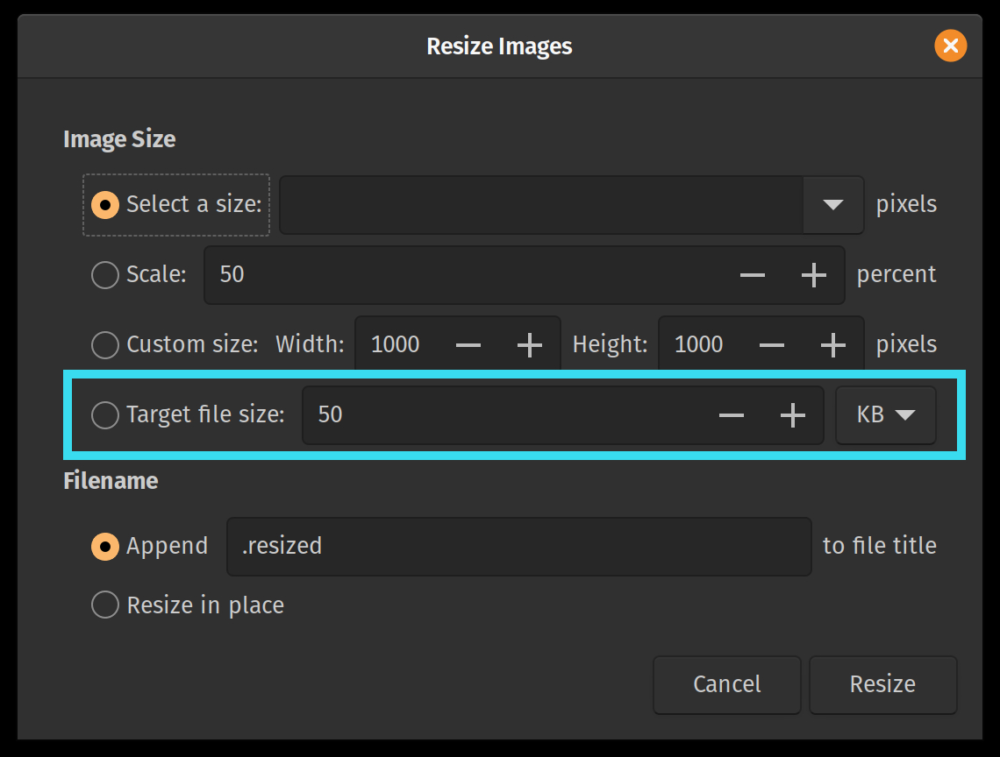
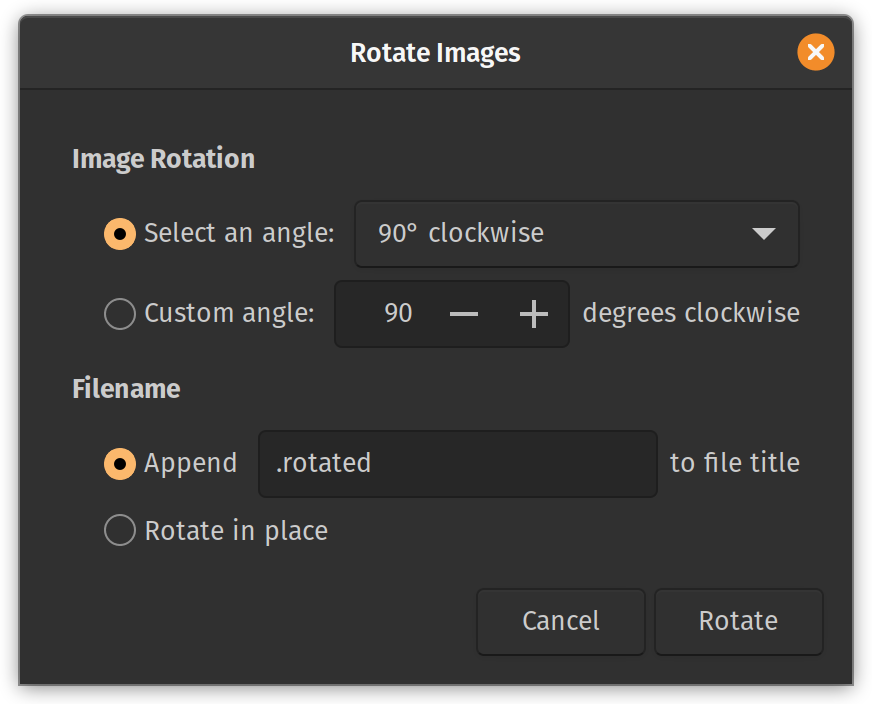

# Nautilus-Image-Converter-Legacy

An extension for the GNOME Nautilus file manager to quickly resize and rotate images from the right-click context menu.

This repository is a fork of the original `nautilus-image-converter` from GNOME, updated with a new feature.

## ✨ New Feature: Target File Size

This fork adds a **"Target file size"** option to the "Resize Images" dialog.

This allows you to compress **JPG** and **PNG** images to an approximate target size (e.g., 50 KB), which is perfect for preparing images for web uploads, email, or filling out application forms.


---

## Core Features (from Original Project)

All the original features of the `nautilus-image-converter` are fully intact:

* **Resize by Scale:** Scale images by a percentage (e.g., 50%).
* **Resize by Custom Size:** Set a specific pixel width and height.
* **Rotate Images:** Rotate 90°, 180°, or by a custom angle.
* **In-Place or New File:** Choose to overwrite your original images or create new copies (e.g., `image.resized.jpg`).

  
 


---

## Installation

### 1. Install Dependencies

You will need the build tools, `imagemagick`, and `jpegoptim` (for the new feature).

**On Ubuntu / Pop!_OS / Debian-based systems:**
```bash
sudo apt-get update
sudo apt install libnautilus-extension-dev libgtk-3-dev imagemagick jpegoptim intltool
```

### 2\. Build and Install

```bash
# 1. Clone this repository
git clone https://github.com/Ameen-Sha-Cheerangan/nautilus-image-converter-legacy.git

# 2. Enter the new directory
cd nautilus-image-converter-legacy

# 3. Run configure
./configure

# 4. Build
make

# 5. Install
sudo make install
```

### 3\. Restart Nautilus (Important\!)

You **must** restart Nautilus for the extension to load.

```bash
nautilus -q
```
Now you can right-click on any JPG or PNG image (this also works when selecting multiple images at once) to see the new options.

### 4\. Uninstall

You **must** navigate to the directory `nautilus-image-converter-legacy`

```bash
sudo make uninstall
```

Now you are free to remove the directory.

-----

## Original Project

This repository is a fork of the original `nautilus-image-converter`, an open-source utility for GNOME. The new "Target file size" feature was added by [Ameen Sha Cheerangan](https://github.com/Ameen-Sha-Cheerangan).

The base code for this fork was sourced directly from the version (by using `apt source nautilus-image-converter`) provided by the official Ubuntu `apt` repositories (0.3.1~git20110416-2), which served as a stable, legacy foundation.

This original project was created by Jürg Billeter and later maintained as part of the official GNOME project. The legacy source repository for that project is believed to be:

`http://git.gnome.org/browse/nautilus-image-converter/` (which returns 404 by the way)

---


## Issues

If you find any issues or have suggestions, please [open an issue](https://github.com/Ameen-Sha-Cheerangan/nautilus-image-converter-legacy/issues).

If you found this tool helpful, please consider giving it a ⭐ on [GitHub](https://github.com/Ameen-Sha-Cheerangan/nautilus-image-converter-legacy)!

---

## ☕ Support the developer

If this tool helped you, consider supporting its developer!

### 🌐 International Users
You can support me instantly via **Ko-fi**.

<a href="https://ko-fi.com/ameen_sha" target="_blank">
  
</a>

### 🇮🇳 Users in India (UPI)
You can support directly via any UPI app (GPay, PhonePe, Paytm) using the QR code or ID below:

<div align="center">
  
  <br/>
  <b>UPI ID:</b> <code>ameenshahcheerangan-1@okicici</code>
</div>

<br/>

> **📱 Viewing on mobile?** 
> * **Direct Link:** [Click here to open your UPI app](https://upi.pe/ameenshahcheerangan-1@okicici?pn=Ameen+Sha+C)
> * **Manual Scan:** Take a screenshot of the QR code above and upload it directly inside your UPI app (GPay, PhonePe, Paytm, etc.).

---


Patches welcomed\!


